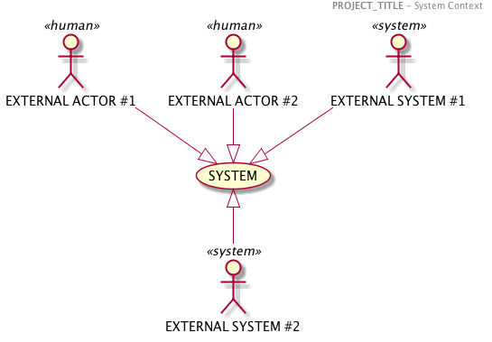

<[Glossary](./0002.Glossary.md) \| [Table of content](./0001.TableOfContent.md) \| [UseCase Model](./0200.UseCaseModel.md) >

* * *

# System Context

> The content filled here has been put only for illustration and to prpose a structure for the work product.
> It has to be contextualized to the project.
> All diagrams have been done relying on the modeling tool PLANTUML

The **SYSTEM** is a platform aiming at XXXXXX.

_It is composed of several components linked over REST API in order to promote lose coupling among components of the system though finely integrated._

The main responsibilities of the **SYSTEM** are to

- **be triggered** by external tiers (loosely coupled exernal component)
- **add a responsability...**

The **SYSTEM** is interacting with the below actors

- **EXTERNAL ACTOR #1** : These users can administrate the component (Access to the logs, configure the process orchestration)
- **add a new actor**  

* * *

Architecture Dossier - Markdown Template - March 2018

<[Glossary](./0002.Glossary.md) \| [Table of content](./0001.TableOfContent.md) \| [UseCase Model](./0200.UseCaseModel.md) >
