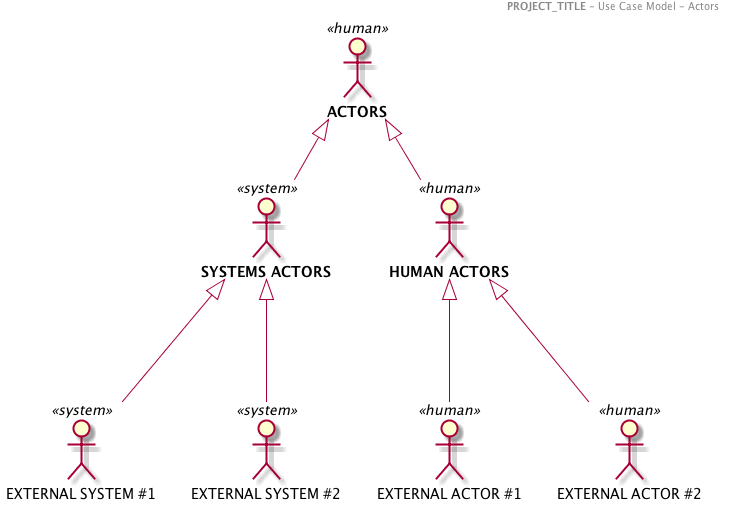
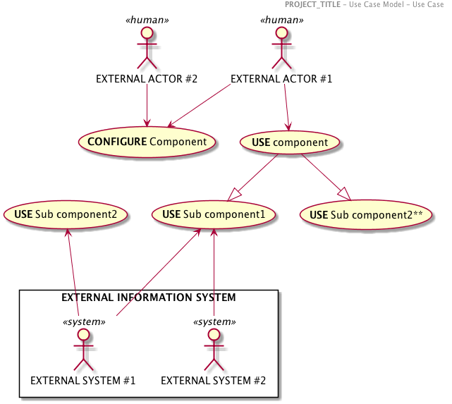
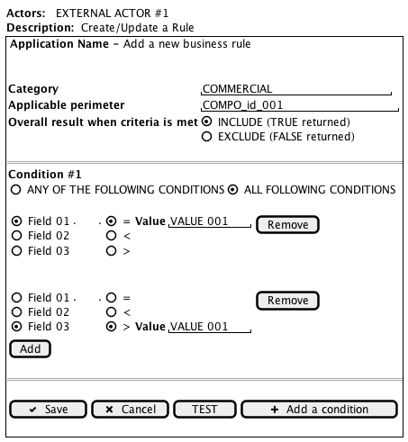

< [System Context](./0100.SystemContext.md) \| [Table of content](./0001.TableOfContent.md) \| [Requirements](./0300.Requirements.md) >

* * *

# Use Case Diagrams

> The content filled here has been put only for illustration and to prpose a structure for the work product.
> It has to be contextualized to the project.
> All diagrams have been done relying on the modeling tool PLANTUML

## Actors

The different actors can be split into 2 categories:

-   **System actors:** Services or applications
-   **Human actors:** End users of the platform  

The human actors can be categorized in 3 populations, each one embracing different permissions

-   The **anonymous** users of the platform (not allowed in this use cases)
-   The **administration team** of the platform
-   The **Business** in charge of the definition of the Business rules

| Actors                 | Type   |
| ---------------------- | ------ |
| **EXTERNAL ACTOR #1**  | HUMAN  |
| **EXTERNAL ACTOR #2**  | HUMAN  |
| **EXTERNAL SYSTEM #1** | SYSTEM |
| **EXTERNAL SYSTEM #2** | SYSTEM |

### EXTERNAL ACTOR #1 (HUMAN)

**Role:** Shall configure the **SYSTEM**, especially in term of process orchestration among  engines .....

**Responsibilities:**

-   **Do** this ....
-   **Do** that ....

### EXTERNAL ACTOR #2 (HUMAN)

**Role:** Shall.....

**Responsibilities:**

-   **Do** this ....
-   **Do** that ....

### EXTERNAL SYSTEM #1 (SYSTEM)

**Role:** Shall.....

**Responsibilities:**

-   **Do** this ....
-   **Do** that ....

### EXTERNAL SYSTEM #2 (SYSTEM)

**Role:** Shall.....

**Responsibilities:**

-   **Do** this ....
-   **Do** that ....
-   

_Remark : Technical roles are not considered here (Platform/System Administration…)_

## UC - CONFIGURE Component

### ACTOR

-   EXTERNAL ACTOR #1

### PRE-CONDITIONS

-   The ACTOR has triggered the service
-   The VALUES passed are compliant with the schema of engines....

### TRIGGER

API Call

### DESCRIPTION

-   **STEP 01** The compliance of the VALUES provided in the payload are assessed with the service JSON Schema. Compliance is reached.

-   **STEP 02** XXXXXXX

### POST-CONDITIONS

Overall Eligibility is returned to the ACTOR

### ALTERNATIVES

_Alternative #1_: This is a variation #1

-   **STEP 01.A**:  

-   **STEP 02.A**:  
-   **STEP 03.A**:  

### Wireframe

> The following screen is intended only for helping the understanding of the use case and orientation for implementation

 \|

* * *

Architecture Dossier - Markdown Template - March 2018

< [System Context](./0100.SystemContext.md) \| [Table of content](./0001.TableOfContent.md) \| [Requirements](./0300.Requirements.md) >
