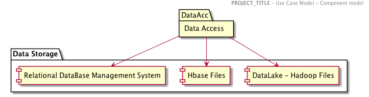
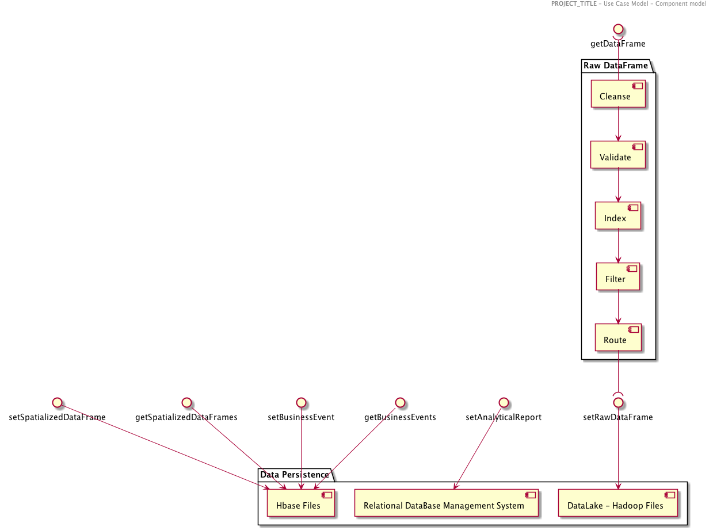
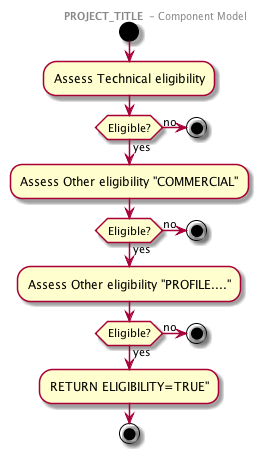

< [Requirements](./0300.Requirements.md) \| [Table of content](./0001.TableOfContent.md) \| [Architecture Overview](./0500.ArchitectureOverview.md) >

* * *

# Component Model

## Static View

### Packages and Components

The SYSTEM can be decomposed into sub-systems and depicted as a package diagram showing dependencies between each package.

The following packages can be defined

| Package | Description |
| ------- | ----------- |
|         | .           |

The following components can be defined in order to support the data frame (example) ingestion

| Component   | DESCRIPTION       | ROLE                                               | RESPONSIBILITIES                                                |
| ----------- | ----------------- | -------------------------------------------------- | --------------------------------------------------------------- |
| **COMPO01** | Add a description | The role of the component is  Add a description | The responsibilities of the component are  Add a description |

## Dynamic View

### Sequence diagram

> A sequence diagram can be generated Architecure

### Process diagram

* * *

Architecture Dossier - Markdown Template - March 2018

< [Requirements](./0300.Requirements.md) \| [Table of content](./0001.TableOfContent.md) \| [Architecture Overview](./0500.ArchitectureOverview.md) >
